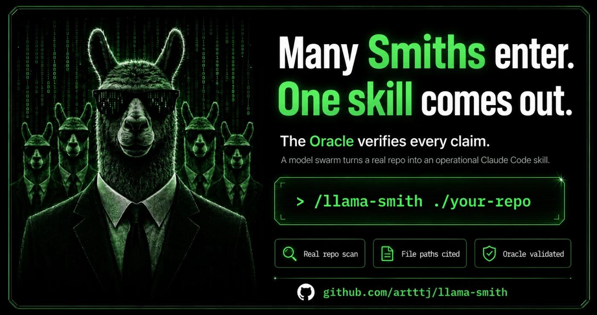
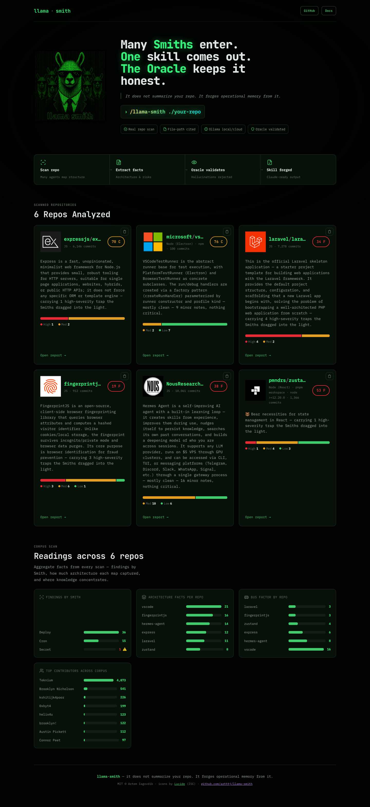
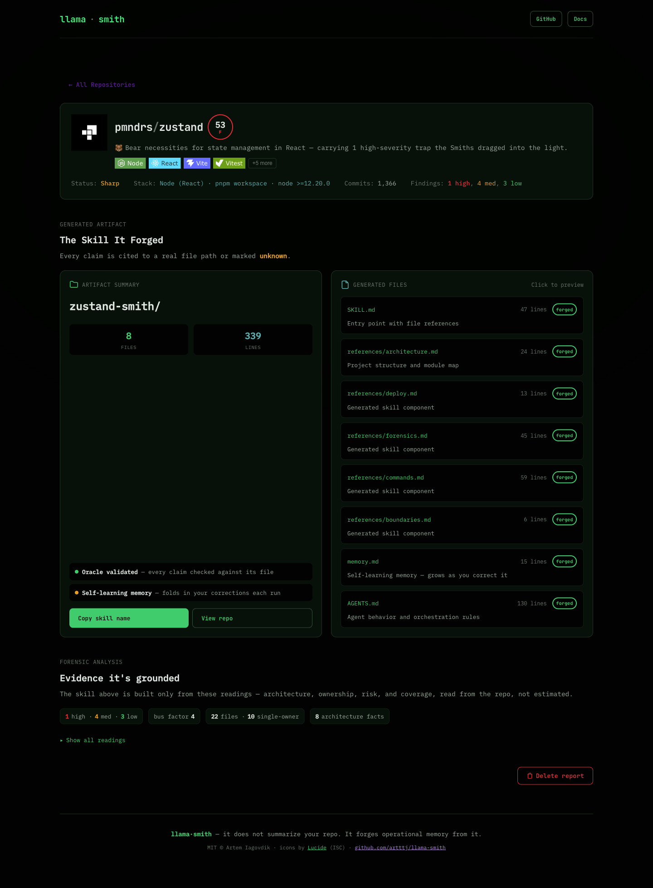

# Llama Smith




Point it at a repo. A swarm of Ollama models maps how the project is built — its architecture, modules, and data flow — and how it deploys, leaks, and breaks, then forges a Claude Code skill from what they can prove. The next agent that opens the repo acts like it has worked there for a year.

The swarm runs on your own Ollama, never on Claude Code's model. Cloud models by default, or `--local` to run models you've pulled locally — no cloud account needed.

```
Many Smiths enter.
One skill comes out.
```

📟  **Live demo:** [artttj.de/llama-smith](https://artttj.de/llama-smith) — the forensic dashboard, scanning real public repos.

## Quick start

```
/plugin marketplace add artttj/llama-smith
/plugin install llama-smith@llama-smith
/reload-plugins
/llama-smith ./path/to/repo
```

Needs Node 20+ and Ollama running. No plugin? Run it directly: `node llama-smith.mjs ./repo`. Full options are in the Install section below.

## What it actually does

Most "repo to AI context" tools summarize what the code *is* and stop there. llama-smith builds the project's map and grounds every line in a file: what the app is and how data moves through it, the deploy that SSHes into a hardcoded IP, the release that publishes on any tag with no gate, the files only one person understands. The stuff nobody writes down (yes, including this README).

Four things happen when you run it.

1. **The swarm reads the repo.** An architecture Smith maps what the app is, its modules, data flow, data model, and entrypoints. Three more look at CI, deploy scripts, compose files, and cron config, one each for deploy/rollback, secrets, and jobs. A single pass is moody, so the ops Smiths run a couple of rounds and union the results.
2. **The Oracle checks their work.** A stronger model re-reads every claim against the file it cites and drops anything the file does not support. It caught the swarm claiming "previous image versions are lost" when the workflow also pushes a content-hash tag, so they aren't. Architecture claims go through the same gate, and an uncited claim never survives.
3. **Deterministic extractors fill in the facts.** No model touches these: the stack and entrypoints from manifests, the real build/test/deploy commands from `package.json` and CI, the do-not-touch boundaries (lockfiles, generated dirs, `.env`), the churn hotspots, and the git forensics — bus factor and single-owner files.
4. **The forge writes the skill.** A deterministic step turns the surviving, cited material into a `<repo>-smith/` folder. No model writes the skill, so the skill can't hallucinate.

## What you get

A skill folder, architecture-first:

```
<repo>-smith/
├── SKILL.md                       what to read first, and when
├── references/
│   ├── architecture.md            what the app is, modules, data flow, data model
│   ├── deploy.md / jobs.md / secrets.md   operational risk, by Smith
│   ├── fragility.md               churn hotspots, single-owner ones flagged
│   ├── forensics.md               bus factor, single-owner files, module ownership
│   ├── commands.md                real build/test/deploy commands, cited
│   └── boundaries.md              files an agent must not hand-edit, and why
├── memory.md                      long-term memory, grows as you correct it
└── AGENTS.md                      the same map for opencode, Cursor, and Codex
```

The `AGENTS.md` is the cross-tool version: a single thorough file so anyone on opencode or Cursor gets the same architecture-first map, not just Claude Code.

## Dashboard

Browse scan results as a self-contained HTML dashboard. In Claude Code:

```
/llama-smith-dashboard
```

Without the plugin: `node llama-smith.mjs serve` builds and serves on localhost:7777.



Each repo gets its own page, and the forged skill is the headline, not something buried under metrics. The skill sits right under the repo identity with the files it wrote, and two status lines: **Oracle validated** (every claim was checked against its cited file) and **self-learning memory** (your corrections fold in on the next run).



Under the skill is the evidence it was built from. A repo-health card leads with the A–F grade, then segmented bars break down findings by severity and single-owner versus shared code, and ranked bars cover churn hotspots, architecture coverage, module ownership, and top contributors. An Oracle verdict card closes the page with the citation coverage. The grade comes from validated findings and how concentrated the code ownership is, measured by bus factor and single-owner files. You can delete a report straight from the dashboard.

Color carries one meaning each: green healthy, red critical, amber watch, cyan neutral evidence. Each page inlines its own CSS and hero image, so a single `.html` file works anywhere.

## Install (Claude Code plugin)

```
/plugin marketplace add artttj/llama-smith
/plugin install llama-smith@llama-smith
/reload-plugins
```

Then point it at a repo:

```
/llama-smith ./path/to/repo
```

The plugin adds four commands, so you never type raw `node`:

- `/llama-smith <repo>` — scan, validate, forge the skill
- `/llama-smith-lesson <repo> "<correction>"` — teach the skill; folded into memory on the next run
- `/llama-smith-dashboard` — build and serve the forensic dashboard on localhost
- `/llama-smith-diff <repo> [--base <ref>] [--head <ref>]` — scan only what a PR changed

You need Node 20+ and Ollama running.

In cloud mode the swarm sends file contents to your cloud Ollama, including config and `.env` files the secret Smith reads. Run it only on repos you own or are authorized to scan, and use `--local` when the contents must not leave your machine.

Or skip the plugin and run it directly:

```bash
node llama-smith.mjs ./repo                # scan, validate, forge the skill
node llama-smith.mjs ./repo --scan-only    # findings only, write no skill
node llama-smith.mjs ./repo --local        # local Ollama models
node llama-smith.mjs ./repo --rounds 3     # more recall, more time
```

It writes the skill into `<repo>/.claude/skills/<repo>-smith/` and the raw findings into `<repo>/.smith/findings.json`. Open Claude Code in that repo and the skill shows up on its own.

## It learns

When the agent gets something wrong and you correct it, tell the skill:

```
/llama-smith-lesson ./repo "deploy from production, not main"
```

The **Self-Learning Memory** takes that lesson in at high confidence and folds it into `memory.md` on the next run. Corrections are kept per repo, so one project's scar tissue never leaks into another's. Observations mined from past sessions enter low and only stick if they keep showing up.

## Under the hood

Zero dependencies. Node 20+ and `node --test`. A thin CLI over a few small modules: the swarm and architecture Smith (`lib/scan.mjs`), the Oracle (`lib/oracle.mjs`), the deterministic extractors (`lib/project.mjs`, `lib/commands.mjs`), the git forensics (`lib/forensics.mjs`, `lib/churn.mjs`), the forge (`lib/skill.mjs`), and the lessons store. Built on Ollama, dispatched the same way as [llama-review](https://github.com/artttj/llama-review).

## Honest limits

- It's only as good as the models. The ops swarm is stochastic, which is why it runs rounds, and a fully reworded duplicate finding can still slip past the dedup.
- The Oracle fixes false positives, not false negatives. If no Smith looks at a file, nothing catches what it missed.
- Forensics read git authorship. They surface real contributor names from history and need a few months of commits to mean anything.
- Run it on repos you own or are cleared to scan. It names secrets by location, never by value, and it never touches production on its own.
